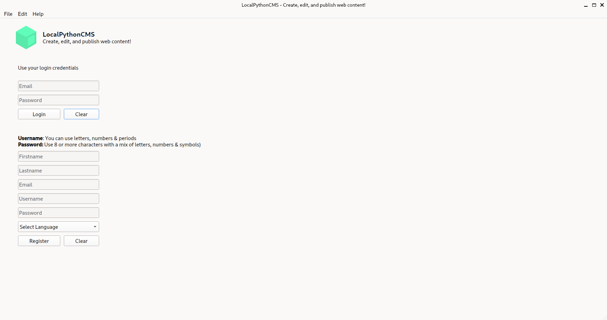
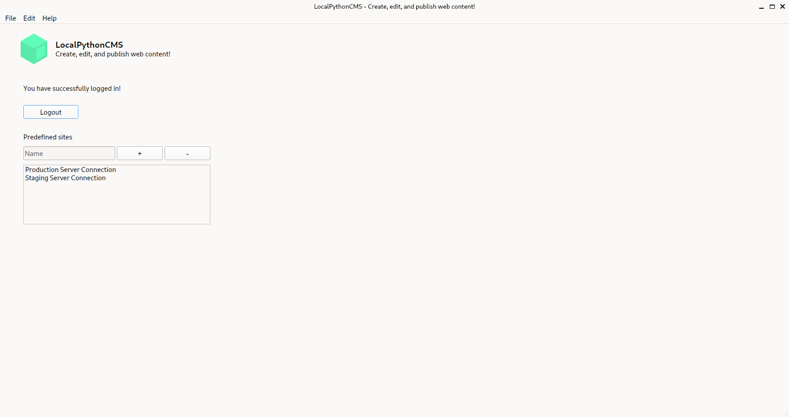
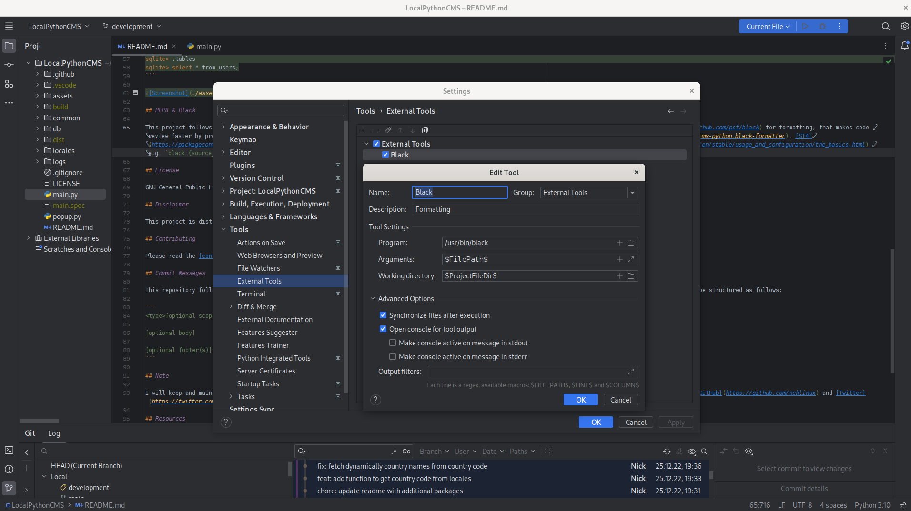
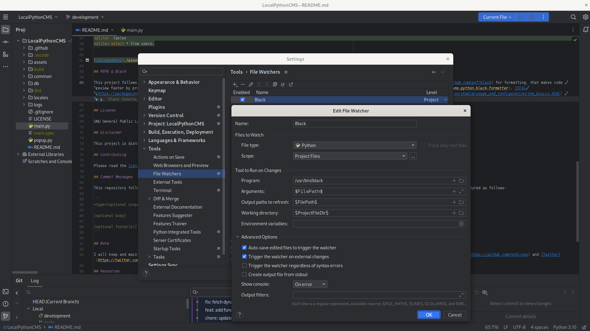

# LocalPythonCMS


A content management system (CMS) written in Python that allows you to create, edit, and publish web content

## Build Setup

```bash
# Arch Linux - required packages
$ sudo pacman -Syu
$ sudo pacman -S python-pip sqlite openssh upx
$ python -V && pip --version
$ pip install python-i18n pandas country_converter black pyinstaller

# Ubuntu - required packages
$ sudo apt update
$ sudo apt install python3-pip sqlite3 openssh-client upx
$ python3 -V && pip3 --version
$ pip3 install python-i18n pandas country_converter black pyinstaller

# Clone repository
$ git clone git@github.com:ncklinux/LocalPythonCMS.git
$ cd LocalPythonCMS
$ git checkout -b YOUR_BRANCH_NAME

# Virtual environment (recommended). To manage libraries with pip, the following commands are used to create and activate the required virtual environment.
$ python -m venv .venv
$ source .venv/bin/activate
$ pip install python-i18n pandas country_converter black pyinstaller requests PyQt6 PyYAML mypy flake8

# Launch
$ python main.py

# Build for production
$ wget https://github.com/konstantinstadler/country_converter/blob/master/country_converter/country_data.tsv
# Another way it's to find the file and use the relative path to country_data.tsv e.g. --add-data '../.local/lib/python3.YOUR_VERSION/site-packages/country_converter/country_data.tsv' or, just copy country_data.tsv in LocalPythonCMS directory
# find / -type f -name "country_data.tsv" 2>&1 | grep -v 'Permission denied'
$ python -m PyInstaller --noconsole --onefile --windowed --exclude-module tkinter --add-data 'country_data.tsv:country_converter' main.py
# There are also some other options, like fbs (based on PyInstaller) or Flatpak
```

## Motivation

Having a local CMS that publishes only the content you choose, on a remote server (securely via [SSH](https://www.openssh.com) and [Ed25519](https://ed25519.cr.yp.to/) elliptic curve signature key pair, as the book [Practical Cryptography with Go](https://leanpub.com/gocrypto/read#leanpub-auto-chapter-5-digital-signatures) suggests that those keys are more secure and efficient) is great for many reasons, for example maintainability! Being able to update the CMS without hassle and system and network administration knowledge (just like updating your web browser) makes it fun :wink:

Most importantly, your data belongs to you, locally! Keeping the CMS (Content Management System), in other words the administration, where you edit the content of the pages, stored on your local :computer: including backups (before any commit, with Git of course), makes it secure :lock: by default! Simply because, there is no reason for the administration side of your website to be always online, including sensitive, in most cases unencrypted data on a remote server (that someone else rents to you), without that data even needing to be called for changes so often (in most of the times), I just don't see the point anymore. **So I decided i decide to experiment, to take down this piece, locally, since in return it gives 50% less security problems, because it's not exposed to the public. It's that simple!**

Just think about it, in the 90s might was "the thing" and a good idea to start writing a CMS, including admin pages along with the website, but now it's another century, things have changed, the security problems are growing every day, we have to do something! I want to hand down a safer digital world, I thought about it, I found a practical solution and I'm working on it.

John Johnson says _“First, solve the problem. Then, write the code.”_

| Result 01                                                | Result 02                                                |
| -------------------------------------------------------- | -------------------------------------------------------- |
|  |  |

## Internationalization

This project uses [python-i18n](https://pypi.org/project/python-i18n/) for translations, an out-of-the-box library for designing and developing software, so it can be adapted for users of different cultures and languages. The files are located in the [locales](https://github.com/ncklinux/LocalPythonCMS/tree/main/locales) directory in [YAML](https://yaml.org/) format. [JSON](https://www.json.org) format is also supported, to be used it must be specified explicitly `i18n.set('file_format', 'json')`

## SQLite

Start the [SQLite](https://sqlite.org/cli.html) program by typing `sqlite3` at the Terminal, followed by the name of the file that holds the database.

```bash
$ sqlite3 assets/sqlite/localpythoncms.sqlite

# SQLite CLI
sqlite> .tables
sqlite> select * from users;
```


## PEP8 & Black

This project follows the [PEP8](https://peps.python.org/pep-0008/) style, which provides guidelines and best practices for writing Python code, and [Black](https://github.com/psf/black) for formatting, that makes code review faster by producing the smallest diffs possible (it's already available for most editors and IDEs [VSCode](https://marketplace.visualstudio.com/items?itemName=ms-python.black-formatter), [ST4](https://packagecontrol.io/packages/python-black), [PyCharm](https://plugins.jetbrains.com/plugin/14321-blackconnect) and also via [CLI](https://black.readthedocs.io/en/stable/usage_and_configuration/the_basics.html) e.g. `black {source_file_or_directory}`, to list all options use `black --help`).

If you use PyCharm but for whatever reason you don't want to use the [BlackConnect](https://plugins.jetbrains.com/plugin/14321-blackconnect) plugin and therefore [blackd](https://black.readthedocs.io/en/stable/usage_and_configuration/black_as_a_server.html), follow the screenshots below to set up [black](https://pypi.org/project/black/) as an external tool with a file watcher in order to run it on save. Use `which black` to identify the location of the executable and add it in the "Program" input field.

| IDE 01                                    | IDE 02                                    |
| ----------------------------------------- | ----------------------------------------- |
|  |  |

## Type Annotations

[Mypy](https://mypy-lang.org) is an optional static type checker for Python that aims to combine the benefits of dynamic (or "duck") typing and static typing. Mypy combines the expressive power and convenience of Python with a powerful type system and compile-time type checking. Mypy type checks standard Python programs; run them using any Python VM with basically no runtime overhead.

```bash
$ mypy --ignore-missing-imports main.py
# Success: no issues found in 1 source file
```

## Linter

Linting means running a quality tool on the code. The linter will perform syntax checks and give you instructions, security tips and help you avoid bugs. There are some linters out there, the most tried and tested is [Flake8](https://flake8.pycqa.org), "the wrapper which verifies pep8, pyflakes, and circular complexity", also has a low false positive rate.

## Troubleshooting

If you encountered the following module error, in fact, any similar module error `No module named 'pip'`, see below for more details:

```bash
$ python main.py

# Traceback (most recent call last):
#   File ".venv/bin/pip", line 5, in <module>
#     from pip._internal.cli.main import main
# ModuleNotFoundError: No module named 'pip'
```

It turns out that Virtualenv is not up to date, use the following commands to fix the problem:

```bash
$ deactivate
$ rm -rf .venv
$ python -m venv .venv
$ source .venv/bin/activate
$ pip install ...
```

And reinstall all the PIP packages as you did at the [beginning](https://github.com/ncklinux/LocalPythonCMS?tab=readme-ov-file#build-setup) when you started with the program, then execute `python main.py` again, this time should work without module issues.

## License

GNU General Public License v3.0 - See the [LICENSE](https://github.com/ncklinux/LocalPythonCMS/blob/main/LICENSE) file in this project for details.

## Disclaimer

This project is distributed FREE & WITHOUT ANY WARRANTY. Report any bugs or suggestions as an [issue](https://github.com/ncklinux/LocalPythonCMS/issues/new).

## Contributing

Please read the [contribution](https://github.com/ncklinux/LocalPythonCMS/blob/main/.github/CONTRIBUTING.md) guidelines.

## Commit Messages

This repository follows the [Conventional Commits](https://www.conventionalcommits.org) specification, the commit message should never exceed 100 characters and must be structured as follows:

```
<type>[optional scope]: <description>

[optional body]

[optional footer(s)]
```

## Note

I will keep and maintain this project as open source forever! [Watch it](https://github.com/ncklinux/LocalPythonCMS/subscription), give it a :star: and follow me on [GitHub](https://github.com/ncklinux) and [Twitter](https://twitter.com/ncklinux)

## Resources

Icons from [Google Material Symbols](https://fonts.google.com/icons)

## Powered by


