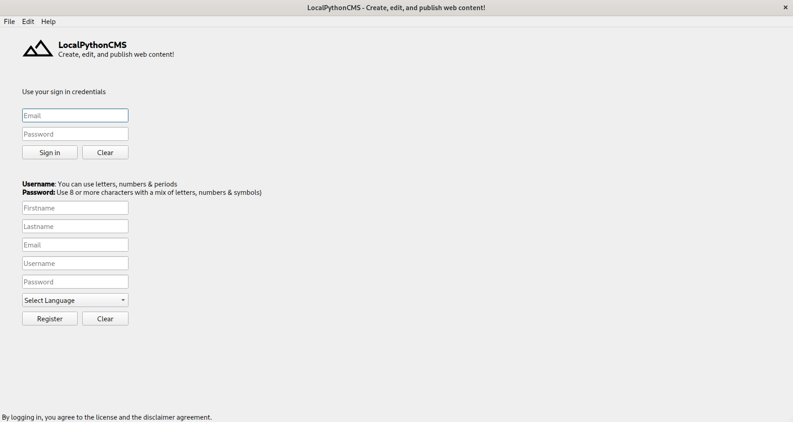
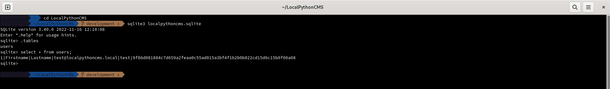
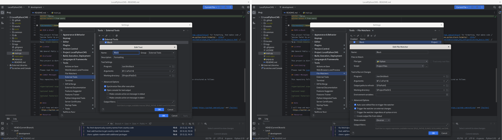

# LocalPythonCMS

A content management system (CMS) written in Python that allows you to create, edit, and publish web content

## Build Setup

```bash
# Arch Linux - required packages
$ sudo pacman -Syu
$ sudo pacman -S python-pyqt5 python-pyqt5-webengine python-pip sqlite openssh upx
$ python -V && pip --version
$ pip install python-i18n pandas country_converter black pyinstaller

# Ubuntu - required packages
$ sudo apt update
$ sudo apt install python3-pyqt5 python3-pyqt5.qtwebengine python3-pip sqlite3 openssh-client upx
$ python3 -V && pip3 --version
$ pip3 install python-i18n pandas country_converter black pyinstaller

# Clone repository
$ git clone git@github.com:ncklinux/LocalPythonCMS.git
$ cd LocalPythonCMS
$ git checkout -b YOUR_BRANCH_NAME

# Virtual environment (recommended). To manage libraries with pip, the following commands are used to create and activate the required virtual environment.
$ python -m venv .venv
$ source .venv/bin/activate
$ pip install python-i18n pandas country_converter black pyinstaller requests PyQt5 PyQtWebEngine PyYAML

# Launch
$ python main.py

# Build for production
$ wget https://github.com/konstantinstadler/country_converter/blob/master/country_converter/country_data.tsv
# Another way it's to find the file and use the relative path to country_data.tsv e.g. --add-data '../.local/lib/python3.YOUR_VERSION/site-packages/country_converter/country_data.tsv' or, just copy country_data.tsv in LocalPythonCMS directory
# find / -type f -name "country_data.tsv" 2>&1 | grep -v 'Permission denied'
$ python -m PyInstaller --noconsole --onefile --windowed --exclude-module tkinter --add-data 'country_data.tsv:country_converter' main.py
# There are also some other options, like fbs (based on PyInstaller) or Flatpak
```

## Motivation

Having a local CMS that publishes only the content you choose, on a remote server (securely via [SSH](https://www.openssh.com) and [Ed25519](https://ed25519.cr.yp.to/) elliptic curve signature key pair, as the book [Practical Cryptography with Go](https://leanpub.com/gocrypto/read#leanpub-auto-chapter-5-digital-signatures) suggests that those keys are more secure and efficient) is great for many reasons, for example maintainability! Being able to update the CMS without hassle and system and network administration knowledge (just like updating your web browser) makes it fun :wink:

Most importantly, you own your data, locally! Keeping your data stored on your local computer :computer: (including backups) makes it safe :lock: by default! Simply because, there is no reason to store sensitive data on a remote server and leave them there, without that data even needing (in most times) to be called and used on the websites.

John Johnson says _“First, solve the problem. Then, write the code.”_



## Internationalization

This project uses [python-i18n](https://pypi.org/project/python-i18n/) for translations, an out-of-the-box library for designing and developing software, so it can be adapted for users of different cultures and languages. The files are located in the [locales](https://github.com/ncklinux/LocalPythonCMS/tree/main/locales) directory in [YAML](https://yaml.org/) format. [JSON](https://www.json.org) format is also supported, to be used it must be specified explicitly `i18n.set('file_format', 'json')`

## SQLite

Start the [SQLite](https://sqlite.org/cli.html) program by typing `sqlite3` at the Terminal, followed by the name of the file that holds the database.

```bash
$ sqlite3 assets/sqlite/localpythoncms.sqlite

# SQLite CLI
sqlite> .tables
sqlite> select * from users;
```



## PEP8 & Black

This project follows the [PEP8](https://peps.python.org/pep-0008/) style, which provides guidelines and best practices for writing Python code, and [Black](https://github.com/psf/black) for formatting, that makes code review faster by producing the smallest diffs possible (it's already available for most editors and IDEs [VSCode](https://marketplace.visualstudio.com/items?itemName=ms-python.black-formatter), [ST4](https://packagecontrol.io/packages/python-black), [PyCharm](https://plugins.jetbrains.com/plugin/14321-blackconnect) and also via [CLI](https://black.readthedocs.io/en/stable/usage_and_configuration/the_basics.html) e.g. `black {source_file_or_directory}`, to list all options use `black --help`).

If you use PyCharm but for whatever reason you don't want to use the [BlackConnect](https://plugins.jetbrains.com/plugin/14321-blackconnect) plugin and therefore [blackd](https://black.readthedocs.io/en/stable/usage_and_configuration/black_as_a_server.html), follow the screenshots below to set up [black](https://pypi.org/project/black/) as an external tool with a file watcher in order to run it on save. Use `which black` to identify the location of the executable and add it in the "Program" input field.



## License

GNU General Public License v3.0 - See the [LICENSE](https://github.com/ncklinux/LocalPythonCMS/blob/main/LICENSE) file in this project for details.

## Disclaimer

This project is distributed FREE & WITHOUT ANY WARRANTY. Report any bugs or suggestions as an [issue](https://github.com/ncklinux/LocalPythonCMS/issues/new).

## Contributing

Please read the [contribution](https://github.com/ncklinux/LocalPythonCMS/blob/main/.github/CONTRIBUTING.md) guidelines.

## Commit Messages

This repository follows the [Conventional Commits](https://www.conventionalcommits.org) specification, the commit message should never exceed 100 characters and must be structured as follows:

```
<type>[optional scope]: <description>

[optional body]

[optional footer(s)]
```

## Note

I will keep and maintain this project as open source forever! [Watch it](https://github.com/ncklinux/LocalPythonCMS/subscription), give it a :star: and follow me on [GitHub](https://github.com/ncklinux) and [Twitter](https://twitter.com/ncklinux)

## Resources

Icons from [Google Material Symbols](https://fonts.google.com/icons)

## Powered by


