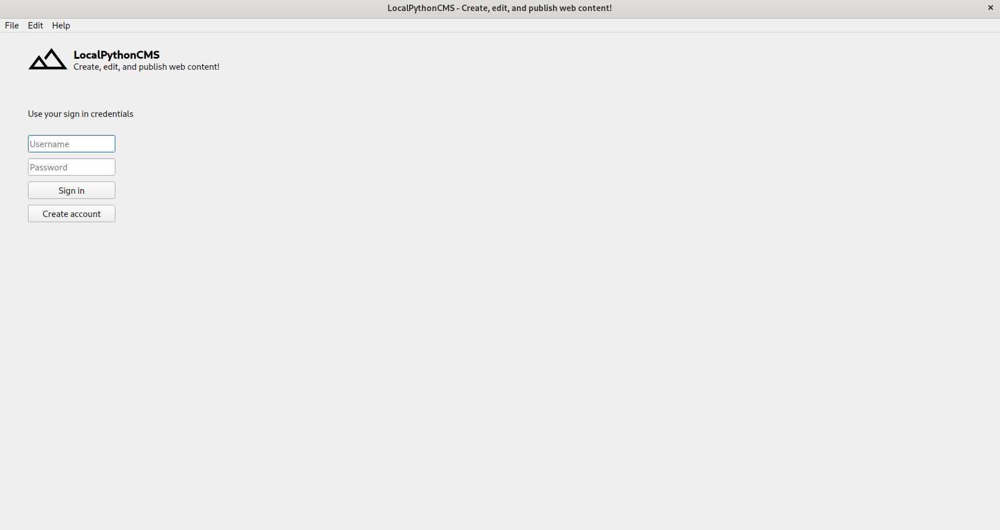

# LocalPythonCMS

A content management system (CMS) written in Python that allows you to create, edit, and publish web content

## Build Setup

```bash
# Arch Linux - install packages
$ sudo pacman -Syu
$ sudo pacman -S python-pyqt5 python-pip
$ python -V && pip --version

# Ubuntu - install packages
$ sudo apt update
$ sudo apt install python3-pyqt5 python3-pip
$ python -V && pip3 --version

# clone repository
$ git clone git@github.com:ncklinux/LocalPythonCMS.git
$ cd LocalPythonCMS
$ git checkout -b YOUR_BRANCH_NAME

# build for production and launch
$ python main.py
```

## Motivation

Having a local CMS that publishes only the content you choose, on a remote server (securely via SSH) is great for many reasons, for example maintainability! Being able to update the CMS without hassle and system and network administration knowledge (just like updating your web browser) makes it fun :wink:  

Most importantly, you own your data, locally! Keeping your data stored on your local computer :computer: (including backups) makes it safe :lock: by default! Simply because, there is no reason to store sensitive data on a remote server and leave them there, without that data even needing (in most times) to be called and used on the websites.  

John Johnson says *“First, solve the problem. Then, write the code.”*



## License

GNU General Public License v3.0 - See the [LICENSE](https://github.com/ncklinux/LocalPythonCMS/blob/main/LICENSE) file in this project for details.

## Disclaimer

This project is distributed FREE & WITHOUT ANY WARRANTY. Report any bugs or suggestions here as an [issue](https://github.com/ncklinux/LocalPythonCMS/issues/new).

## Contributing

It's best to open an [issue](https://github.com/ncklinux/LocalPythonCMS/issues/new). It's even better to accompany it with a Pull Request ;)

## Commit Messages

This repository follows the [Conventional Commits](https://www.conventionalcommits.org) specification, the commit message should never exceed 100 characters and must be structured as follows:

```
<type>[optional scope]: <description>

[optional body]

[optional footer(s)]
```

## Note

Gonna keep this project as open source forever! [Watch this repo](https://github.com/ncklinux/LocalPythonCMS/subscription), Star it and follow me on [GitHub](https://github.com/ncklinux) and [Twitter](https://twitter.com/ncklinux)

## Resources

Icons from [Google Material Symbols](https://fonts.google.com/icons)

## Frameworks, programming languages and development tools


